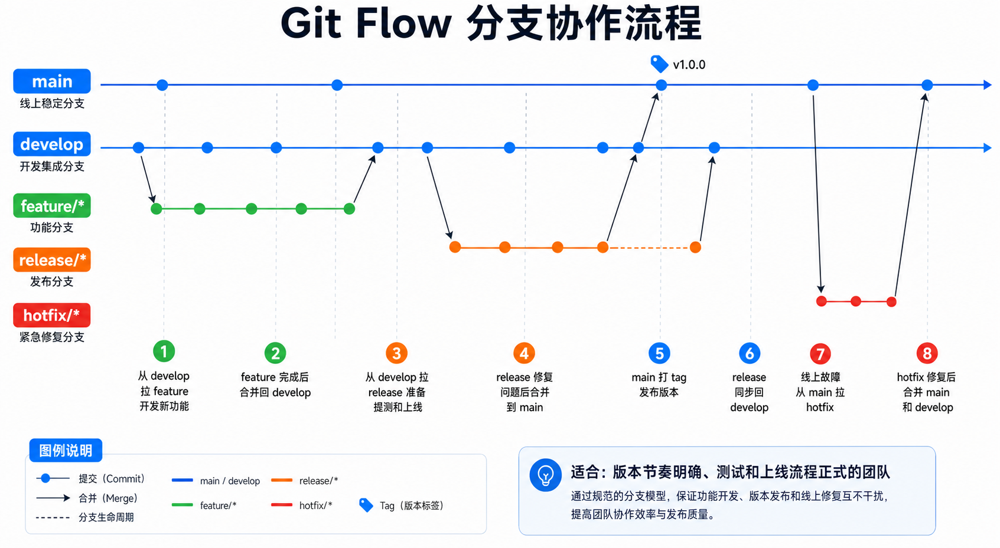
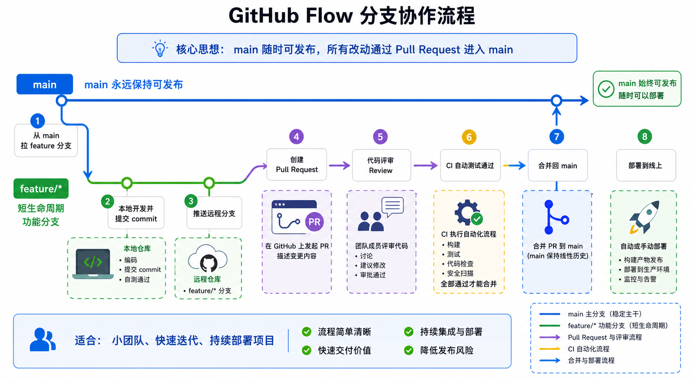
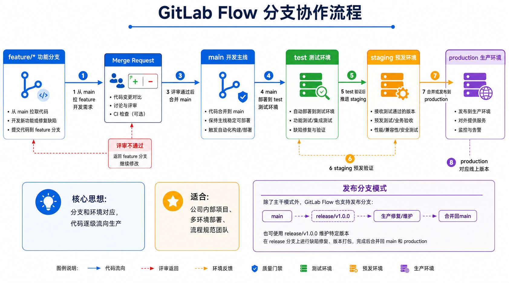
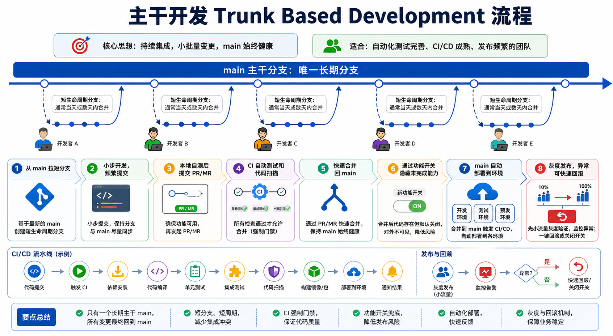

# Git 分支协作策略说明

本文档用于学习软件开发中常见的 Git 分支协作方式，重点理解 Git Flow，同时了解 GitHub Flow、GitLab Flow、主干开发等常见策略。

## 为什么要有分支协作

在最简单的个人项目里，可能只有一个人、一个目录、一份代码。你写完代码，保存一下，程序能跑就继续往下写。

但是软件一旦进入团队协作，就会出现很多问题：

- 多个人同时改同一份代码，容易互相覆盖。
- 有人正在开发新功能，但线上突然出现 bug，需要马上修复。
- 某个功能还没做完，但另一个功能已经可以上线。
- 测试环境需要稳定版本，研发环境又需要继续开发。
- 上线失败时，需要快速知道线上版本对应哪一份代码。

分支协作就是为了解决这些问题出现的。

### 没有分支会发生什么

假设一个团队只有一个 `main` 分支，所有人都直接往 `main` 提交代码。

可能会出现这种情况：

```text
研发 A：正在开发登录功能，代码还没写完
研发 B：正在开发 Todo 列表，代码已经完成
测试：想测试 Todo 列表
运维：线上登录出 bug，需要马上修复
```

如果大家都直接改 `main`：

- B 的功能虽然完成了，但 `main` 里混着 A 未完成的代码。
- 测试拿到的版本可能跑不起来。
- 线上修复必须基于稳定代码，但 `main` 已经变得不稳定。
- 如果上线出问题，很难判断是哪一次提交引入的问题。

这时就需要分支把不同工作隔离开。

### 分支解决了什么问题

**1. 隔离开发**

每个功能可以在自己的分支开发，不影响别人。

```text
feature/login
feature/todo-list
feature/todo-filter
```

**2. 保护稳定代码**

`main` 只保存稳定、可上线的代码。未完成的代码先放在功能分支里。

**3. 支持多人并行**

不同研发可以同时开发不同功能，最后再通过合并把代码集成起来。

**4. 支持测试和上线节奏**

开发分支、测试分支、发布分支可以对应不同阶段，让测试和上线更可控。

**5. 支持线上紧急修复**

线上出问题时，可以从 `main` 拉出 `hotfix` 分支，只修线上问题，不被其他未完成需求影响。

**6. 方便代码评审**

通过 Pull Request 或 Merge Request，可以清楚看到这次分支改了哪些文件、为什么改、有没有风险。

### 分支协作的前世今生

早期开发时，很多团队会通过复制目录或压缩包来保存不同版本：

```text
project-v1
project-v2
project-final
project-final-new
project-final-new-fixed
```

这种方式很容易混乱：

- 不知道哪个版本是最新的。
- 不知道每次改了什么。
- 多人修改后很难合并。
- 出问题后很难回退。

后来出现了版本控制系统，比如 CVS、SVN。它们可以记录代码历史，但早期分支和合并成本较高，很多团队仍然不太敢频繁创建分支。

Git 出现后，分支变得非常轻量。创建分支、切换分支、合并分支都很快，所以团队开始大量使用分支来组织协作流程。

也就是说，分支协作的演进大概是：

```text
手动复制代码
  ↓
集中式版本控制 SVN
  ↓
分布式版本控制 Git
  ↓
Git Flow / GitHub Flow / GitLab Flow / 主干开发
```

### 分支不是目的，交付才是目的

分支本身不是为了让流程变复杂，而是为了让团队更稳定地交付软件。

好的分支策略应该帮助团队回答这些问题：

- 线上稳定代码在哪里？
- 新功能在哪里开发？
- 测试应该测哪个版本？
- 这次上线包含哪些改动？
- 线上 bug 应该从哪里修？
- 修复后如何同步回开发分支？

如果一个分支策略不能帮助回答这些问题，反而让团队更混乱，那它就不适合当前团队。

### 一个简单比喻

可以把 `main` 想成已经正式出版的书，把功能分支想成作者正在写的新章节。

```text
main：已经出版的正式版本
feature/*：正在写的新章节
develop：编辑部正在汇总的草稿版本
release/*：准备印刷前的校对版本
hotfix/*：正式出版后发现错别字，紧急修订
```

这样就不会把没写完的章节直接塞进正式出版版本里。

## 先理解几个基础概念

在团队开发中，分支不是随便创建的。分支的核心作用是：

- 隔离不同功能的开发。
- 保护稳定代码。
- 支持多人同时开发。
- 支持测试、灰度、上线和紧急修复。

常见分支类型：

```text
main/master      稳定主分支，通常代表线上代码
develop          开发集成分支，多个功能先合到这里
feature/*        功能分支，用来开发新需求
release/*        发布分支，用来准备上线版本
hotfix/*         紧急修复分支，用来修线上问题
bugfix/*         普通缺陷修复分支
```

## 1. Git Flow

Git Flow 是一种比较完整、规范的分支模型，适合版本节奏明确、上线流程比较正式的项目。



### 核心分支

```text
main
develop
feature/*
release/*
hotfix/*
```

### 分支职责

**main**

`main` 分支保存线上稳定代码。每一次合并到 `main`，通常都代表一次正式上线。

**develop**

`develop` 是日常开发集成分支。多个功能分支完成后，先合并到 `develop`，统一联调和测试。

**feature/**

`feature/*` 是功能开发分支。每个新需求可以从 `develop` 拉一个独立分支。

示例：

```bash
git checkout develop
git checkout -b feature/todo-status
```

**release/**

`release/*` 是发布准备分支。当 `develop` 中的功能准备进入测试和上线阶段时，从 `develop` 拉出 release 分支。

示例：

```bash
git checkout develop
git checkout -b release/v1.0.0
```

这个分支主要做：

- 修复测试阶段发现的问题。
- 调整版本号。
- 更新发布说明。
- 做上线前最后验证。

**hotfix/**

`hotfix/*` 是线上紧急修复分支。它通常从 `main` 拉出，因为线上问题要基于线上代码修。

示例：

```bash
git checkout main
git checkout -b hotfix/fix-login-error
```

修完后通常要同时合回：

```text
main
develop
```

这样线上修复不会丢失，也能同步回后续开发分支。

### Git Flow 流程图

```text
main        o----------------------o----------o
             \                    /          /
hotfix/*      \----hotfix---------/          /
               \                            /
develop         o------o------o------------o
                 \      \      \
feature/*         f1     f2     f3
                         \
release/*                 release/v1.0.0
```

### Git Flow 完整流程示例

以 TaskNest 新增“任务状态筛选”为例：

1. 从 `develop` 创建功能分支：

```bash
git checkout develop
git checkout -b feature/todo-filter
```

2. 在功能分支开发代码：

```bash
git add .
git commit -m "添加任务状态筛选接口"
```

3. 功能完成后合并到 `develop`：

```bash
git checkout develop
git merge feature/todo-filter
```

4. 准备发布时创建 release 分支：

```bash
git checkout develop
git checkout -b release/v1.0.0
```

5. 测试完成后合并到 `main`：

```bash
git checkout main
git merge release/v1.0.0
git tag v1.0.0
```

6. 再把 release 的修复同步回 `develop`：

```bash
git checkout develop
git merge release/v1.0.0
```

### Git Flow 优点

- 分支职责清晰。
- 适合多人协作。
- 适合有测试、灰度、上线流程的团队。
- 支持线上紧急修复。

### Git Flow 缺点

- 分支比较多，新手容易混乱。
- 合并成本较高。
- 如果团队上线很频繁，流程可能显得重。

## 2. GitHub Flow

GitHub Flow 更简单，适合持续交付、快速迭代的项目。



### 核心思路

```text
main 永远保持可发布状态
新功能从 main 拉分支
开发完成后提 Pull Request
代码评审和自动测试通过后合并 main
main 合并后即可部署
```

### 常见流程

```bash
git checkout main
git pull
git checkout -b feature/todo-create
```

开发完成后：

```bash
git add .
git commit -m "添加创建任务接口"
git push origin feature/todo-create
```

然后在 GitHub 上创建 Pull Request，评审通过后合并到 `main`。

### 适合场景

- 小团队。
- Web 服务。
- 自动化测试比较完善。
- 可以随时部署。

### 优点

- 简单。
- 分支少。
- 适合快速迭代。

### 缺点

- 对自动化测试和部署要求较高。
- 如果没有严格评审，容易把不稳定代码合入 `main`。

## 3. GitLab Flow

GitLab Flow 介于 Git Flow 和 GitHub Flow 之间。它通常会结合环境分支或发布分支。



### 常见模式一：环境分支

```text
main -> test -> staging -> production
```

含义：

- `main`：开发完成的代码。
- `test`：测试环境代码。
- `staging`：预发环境代码。
- `production`：生产环境代码。

代码逐级流动：

```text
main 合并到 test
test 验证后合并到 staging
staging 验证后合并到 production
```

### 常见模式二：发布分支

```text
main
release/v1.0.0
release/v1.1.0
```

适合多个版本同时维护的项目。

### 适合场景

- 公司内部项目。
- 有测试环境、预发环境、生产环境。
- 发布流程比较规范。

## 4. Trunk Based Development 主干开发

主干开发的核心是：所有人尽量频繁地把代码合入主干分支。



### 核心思路

```text
main 是唯一长期分支
功能分支生命周期很短
小步提交
频繁集成
依赖自动化测试保护 main
```

### 适合场景

- 团队工程能力成熟。
- 自动化测试完善。
- CI/CD 流程稳定。
- 功能可以通过开关控制是否对用户开放。

### 常见配套能力

```text
Feature Toggle 功能开关
CI 自动测试
Code Review
自动部署
灰度发布
快速回滚
```

### 优点

- 集成冲突少。
- 发布频率高。
- 适合持续交付。

### 缺点

- 对团队要求高。
- 如果没有测试保护，main 很容易不稳定。

## 5. 常见分支命名规范

推荐使用清晰、有意义的分支名。

```text
feature/todo-create
feature/todo-status-filter
bugfix/todo-title-empty
hotfix/login-token-expired
release/v1.0.0
docs/git-flow-guide
```

命名建议：

- 使用英文小写。
- 单词之间用 `-` 连接。
- 前缀表达分支类型。
- 后面描述具体任务。

## 6. 常见团队协作流程

一个比较完整的团队协作流程通常是：

```text
创建需求
  ↓
创建功能分支
  ↓
本地开发
  ↓
提交 commit
  ↓
推送远程分支
  ↓
创建 Pull Request / Merge Request
  ↓
代码评审
  ↓
自动化测试
  ↓
合并目标分支
  ↓
部署测试环境
  ↓
提测
  ↓
灰度
  ↓
上线
```

## 7. 新手推荐策略

如果你现在是学习阶段，建议先用简化版 Git Flow：

```text
main
develop
feature/*
```

先不用急着引入 `release/*` 和 `hotfix/*`，等你理解基本流程后再加。

### TaskNest 推荐练习方式

1. 创建 `develop` 分支：

```bash
git checkout -b develop
git push -u origin develop
```

2. 每次新功能都从 `develop` 拉功能分支：

```bash
git checkout develop
git pull
git checkout -b feature/todo-user
```

3. 开发完成后提交：

```bash
git add .
git commit -m "添加用户模块"
git push -u origin feature/todo-user
```

4. 合并回 `develop`：

```bash
git checkout develop
git merge feature/todo-user
git push
```

5. 稳定后再合并到 `main`：

```bash
git checkout main
git merge develop
git push
```

## 8. 如何选择分支策略

| 策略 | 复杂度 | 适合场景 |
| --- | --- | --- |
| Git Flow | 高 | 版本发布明确、上线流程正式 |
| GitHub Flow | 低 | 小团队、快速迭代、持续部署 |
| GitLab Flow | 中 | 有测试、预发、生产环境 |
| 主干开发 | 中到高 | 自动化成熟、频繁发布 |

简单记忆：

```text
学习项目：main + develop + feature/*
小团队快速迭代：GitHub Flow
公司正式项目：Git Flow 或 GitLab Flow
大型成熟团队：主干开发 + 自动化测试 + 灰度发布
```

## 9. 和软件交付流程的关系

Git 分支策略不是孤立的，它服务于完整的软件交付流程。

对应关系可以这样理解：

```text
需求评审：确定要开发什么
技术设计：确定代码和分支怎么组织
技术评审：确认方案和影响范围
软件开发：在 feature 分支开发
技术连调：合并到 develop 后联调
提测：release 或 develop 部署到测试环境
灰度：发布到少量用户或小流量
上线：合并 main 并发布生产环境
```

更多完整交付流程可以查看：

- [软件项目交付流程说明](software-delivery-flow.md)
