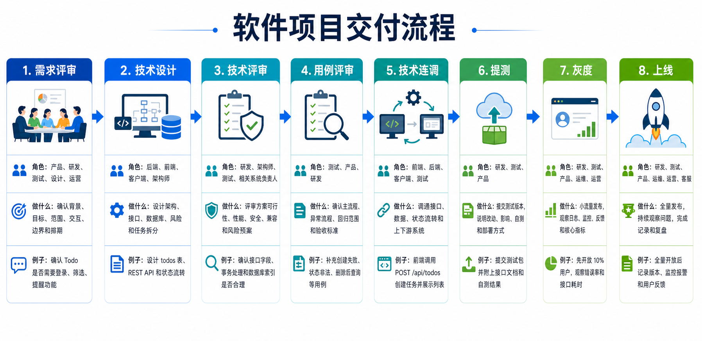

# 软件项目交付流程说明

本文档用于说明一个常见软件项目从需求到上线的完整交付流程。流程覆盖：

```text
需求评审 -> 技术设计 -> 技术评审 -> 用例评审 -> 技术连调 -> 提测 -> 灰度 -> 上线
```

## 流程图



## 1. 需求评审

**参与角色：** 产品、研发、测试、设计、运营

**阶段目标：** 确认需求为什么要做、要做什么、做到什么程度，以及大概什么时候交付。

**主要事项：**

- 明确业务背景和业务目标。
- 确认功能范围，区分本期做什么、不做什么。
- 梳理页面交互、业务规则和边界场景。
- 评估大致工作量和排期风险。

**例子：** 做 Todo 项目时，需要确认是否支持用户登录、任务筛选、任务提醒、任务状态流转等功能。

## 2. 技术设计

**参与角色：** 后端、前端、客户端、架构师

**阶段目标：** 把需求翻译成技术实现方案，确认系统怎么改、接口怎么定、数据怎么存。

**主要事项：**

- 设计系统模块和调用链路。
- 定义接口地址、请求参数和响应结构。
- 设计数据库表结构和字段含义。
- 拆分开发任务，识别技术风险。

**例子：** TaskNest 中可以设计 `todos` 表，并定义 `POST /api/todos`、`GET /api/todos`、`PATCH /api/todos/:id/status` 等接口。

## 3. 技术评审

**参与角色：** 研发、架构师、测试、相关系统负责人

**阶段目标：** 评审技术方案是否合理，提前发现性能、安全、兼容性和上下游影响问题。

**主要事项：**

- 检查接口字段是否完整、命名是否清晰。
- 检查数据库设计是否合理，是否需要索引。
- 确认异常处理、事务处理和数据一致性方案。
- 评估是否影响已有功能或其他系统。

**例子：** 评审 Todo 状态只能是 `pending`、`doing`、`done`，并确认非法状态要返回明确错误。

## 4. 用例评审

**参与角色：** 测试、产品、研发

**阶段目标：** 确认测试要覆盖哪些场景，避免只测正常流程而遗漏异常流程。

**主要事项：**

- 梳理主流程测试用例。
- 补充异常流程和边界场景。
- 确认回归测试范围。
- 统一验收标准。

**例子：** 除了测试创建任务成功，还要测试标题为空、任务不存在、状态非法、删除后再次查询等场景。

## 5. 技术连调

**参与角色：** 前端、后端、客户端、测试

**阶段目标：** 让多个模块或多个系统真正跑通，确认数据能正确流转。

**主要事项：**

- 前后端接口联调。
- 校验请求字段和响应字段。
- 检查状态流转是否符合预期。
- 处理跨系统依赖和环境问题。

**例子：** 前端调用 `POST /api/todos` 创建任务，然后调用 `GET /api/todos` 展示任务列表。

## 6. 提测

**参与角色：** 研发、测试、产品

**阶段目标：** 研发把可测试版本交给测试，并说明改动内容、影响范围和自测结果。

**主要事项：**

- 提供测试环境或测试包。
- 说明本次改动范围。
- 提供接口文档或变更说明。
- 给出自测结果和已知风险。

**例子：** 研发提测 TaskNest 的 Todo CRUD 功能，并说明已经自测创建、查询、修改、删除接口。

## 7. 灰度

**参与角色：** 研发、测试、产品、运维、运营

**阶段目标：** 先让少量用户或小部分流量使用新功能，观察线上是否稳定。

**主要事项：**

- 小流量发布或指定用户发布。
- 观察错误日志、接口耗时和核心指标。
- 收集用户反馈。
- 出现问题时快速回滚或修复。

**例子：** 先给 10% 用户开放新功能，观察 Todo 创建接口错误率和响应时间是否正常。

## 8. 上线

**参与角色：** 研发、测试、产品、运维、运营、客服

**阶段目标：** 确认灰度稳定后全量发布，并持续观察线上效果。

**主要事项：**

- 全量发布功能。
- 观察监控和报警。
- 跟进用户反馈和线上问题。
- 记录上线结果，必要时做复盘。

**例子：** Todo 功能全量上线后，记录版本号、发布时间、负责人、监控结果和后续优化点。

## 简单记忆

```text
需求评审：确认做什么
技术设计：确认怎么做
技术评审：确认方案是否靠谱
用例评审：确认怎么测
技术连调：确认链路能跑通
提测：交给测试正式验证
灰度：小范围上线观察
上线：全量发布并持续关注
```
